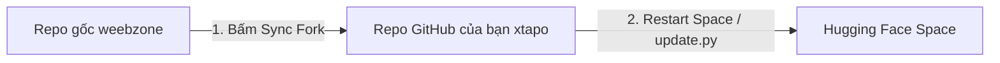

# HƯỚNG DẪN TÍCH HỢP MUSIC PLAYER VÀ ĐỒNG BỘ VỚI REPO GỐC (UPSTREAM)

Tài liệu này hướng dẫn chi tiết cách tích hợp **Music Player** vào dự án **Telegram-Stremio** và cách duy trì cập nhật từ repo gốc (`weebzone/Telegram-Stremio`) mà không làm mất tính năng hay bị xung đột code (conflict).

---

## MỤC LỤC
1. [Nguyên Tắc Kiến Trúc Tách Biệt (Zero-Conflict)](#1-nguyên-tắc-kiến-trúc-tách-biệt-zero-conflict)
2. [Cấu Hình Biến Môi Trường (Quan Trọng)](#2-cấu-hình-biến-môi-trường-quan-trọng)
3. [Hướng Dẫn Tích Hợp Music Player Vào FastAPI](#3-hướng-dẫn-tích-hợp-music-player-vào-fastapi)
4. [Quy Trình Đồng Bộ Khi Repo Gốc Có Update](#4-quy-trình-đồng-bộ-khi-repo-gốc-có-update)
5. [Tự Động Hóa Đồng Bộ Bằng GitHub Actions (Tùy Chọn)](#5-tự-động-hóa-đồng-bộ-bằng-github-actions-tùy-chọn)
6. [Xử Lý Xung Đột (Merge Conflicts) Nếu Có](#6-xử-lý-xung-đột-merge-conflicts-nếu-có)
7. [Hướng Dẫn Đặc Thù Khi Chạy Trên Hugging Face Spaces](#7-hướng-dẫn-đặc-thù-khi-chạy-trên-hugging-face-spaces)

---

## 1. Nguyên Tắc Kiến Trúc Tách Biệt (Zero-Conflict)

Để việc sync từ bản chính (`upstream: weebzone/Telegram-Stremio`) diễn ra trơn tru nhất:
- **Tách riêng thư mục frontend:** Thư mục `Music/` (chứa `index.html`, `style.css`, `app.js`) là thư mục độc lập, không trùng với bất kỳ file nào của repo gốc. Git sẽ không bao giờ báo conflict ở thư mục này.
- **Tách riêng route backend:** Viết logic phục vụ Music Player vào file mới: `Backend/fastapi/routes/music_routes.py`.
- **Hạn chế chỉnh sửa các file lõi:** Chỉ import và mount router tại `Backend/fastapi/main.py` ở cuối file.

---

## 2. Cấu Hình Biến Môi Trường (Quan Trọng)

Dự án Telegram-Stremio có file `update.py` tự động chạy mỗi khi container / bot khởi động:
- Nếu `UPSTREAM_REPO` trỏ về repo gốc của tác giả (`weebzone`), container sẽ **tự động reset đè** toàn bộ code về bản gốc và làm mất code custom của bạn.
- **BẮT BUỘC:** Trong file `config.env` hoặc cấu hình Database Settings, hãy đặt `UPSTREAM_REPO` trỏ về **repo fork của bạn**:

```env
UPSTREAM_REPO="https://github.com/xtapo/Telegram-Stremio"
UPSTREAM_BRANCH="master"
```

---

## 3. Hướng Dẫn Tích Hợp Music Player Vào FastAPI

### Bước 3.1: Kiểm tra thư mục giao diện `Music/`
Đảm bảo thư mục `Music/` nằm ở thư mục gốc của dự án với cấu trúc:
```
Telegram-Stremio/
├── Music/
│   ├── index.html
│   ├── style.css
│   └── app.js
```

### Bước 3.2: Tạo file `Backend/fastapi/routes/music_routes.py`
Tạo file mới `Backend/fastapi/routes/music_routes.py` với nội dung:

```python
import os
from fastapi import APIRouter, Request, Depends
from fastapi.responses import FileResponse, HTMLResponse
from Backend.fastapi.security.credentials import require_auth

router = APIRouter(tags=["music"])

MUSIC_DIR = os.path.abspath("Music")

# Endpoint xem giao diện Music Player
# Bỏ Depends(require_auth) nếu muốn công khai không cần login
@router.get("/music", response_class=HTMLResponse)
async def get_music_player(request: Request, _: bool = Depends(require_auth)):
    index_path = os.path.join(MUSIC_DIR, "index.html")
    if os.path.exists(index_path):
        return FileResponse(index_path)
    return HTMLResponse("<h3>Music Player template not found</h3>", status_code=404)
```

### Bước 3.3: Đăng ký Router trong `Backend/fastapi/main.py`
Mở `Backend/fastapi/main.py` và thêm các dòng sau (đặt ở gần cuối file hoặc sau phần khởi tạo `app = FastAPI(...)`):

```python
# 1. Mount static files cho CSS, JS, Audio của Music Player
import os
from fastapi.staticfiles import StaticFiles

if os.path.exists("Music"):
    app.mount("/Music", StaticFiles(directory="Music"), name="music_assets")

# 2. Đăng ký router
from Backend.fastapi.routes.music_routes import router as music_router
app.include_router(music_router)
```

---

## 4. Quy Trình Đồng Bộ Khi Repo Gốc Có Update

Khi tác giả gốc (`weebzone/Telegram-Stremio`) phát hành bản cập nhật mới, bạn có thể đồng bộ theo 1 trong 2 cách sau:

### Cách 1: Sử Dụng Giao Diện Web GitHub (Khuyên Dùng)
1. Mở trình duyệt và vào repository fork của bạn: `https://github.com/xtapo/Telegram-Stremio`
2. Nhìn vào dòng thông báo phía dưới tên repository:
   > *"This branch is X commits behind weebzone/Telegram-Stremio:master"*
3. Nhấp vào nút **`Sync fork`** ➔ Chọn **`Update branch`**.
4. GitHub sẽ tự động merge các commit mới nhất từ bản gốc vào bản fork của bạn.

---

### Cách 2: Sử Dụng Git CLI (Dòng Lệnh)
Nếu muốn thực hiện trên máy tính qua Terminal / PowerShell:

```bash
# 1. Kiểm tra remote đã có upstream chưa
git remote -v
# Nếu chưa có upstream, thêm bằng lệnh:
# git remote add upstream https://github.com/weebzone/Telegram-Stremio.git

# 2. Chuyển sang nhánh master
git checkout master

# 3. Lấy tất cả commit mới nhất từ repo gốc
git fetch upstream

# 4. Merge code mới vào nhánh master của bạn
git merge upstream/master

# 5. Đẩy code đã cập nhật lên GitHub cá nhân của bạn
git push origin master
```

---

## 5. Tự Động Hóa Đồng Bộ Bằng GitHub Actions (Tùy Chọn)

Nếu bạn muốn GitHub tự động đồng bộ từ repo gốc hàng ngày mà không cần thao tác thủ công:

1. Tạo file: `.github/workflows/sync-upstream.yml`
2. Thêm nội dung sau:

```yaml
name: Sync Upstream

on:
  schedule:
    # Chạy tự động lúc 00:00 UTC mỗi ngày
    - cron: '0 0 * * *'
  workflow_dispatch: # Cho phép bấm chạy thủ công trên GitHub Actions tab

jobs:
  sync:
    runs-on: ubuntu-latest
    steps:
      - name: Checkout target repo
        uses: actions/checkout@v4
        with:
          ref: master
          fetch-depth: 0

      - name: Sync with Upstream
        uses: aormsby/Fork-Sync-With-Upstream-action@v3.4.1
        with:
          upstream_sync_repo: weebzone/Telegram-Stremio
          upstream_sync_branch: master
          target_sync_branch: master
          target_repo_token: ${{ secrets.GITHUB_TOKEN }}
          test_mode: false
```

---

## 6. Xử Lý Xung Đột (Merge Conflicts) Nếu Có

Trong trường hợp hiếm hoi repo gốc sửa đổi đúng dòng code trong `Backend/fastapi/main.py` nơi bạn mount router:

1. Chạy lệnh merge:
   ```bash
   git merge upstream/master
   ```
2. Mở file bị conflict (ví dụ `main.py`) trong trình soạn thảo code (VS Code / Antigravity IDE).
3. Bạn sẽ thấy khối conflict dạng:
   ```python
   <<<<<<< HEAD (Code của bạn)
   app.include_router(music_router)
   ======= (Code từ upstream)
   # Code mới từ upstream
   >>>>>>> upstream/master
   ```
4. Chọn **Accept Both Changes** (Giữ cả hai), đảm bảo giữ lại cả tính năng của upstream và dòng mount `music_router` của bạn.
5. Lưu file, commit và push:
   ```bash
   git add .
   git commit -m "Merge upstream update and resolve conflicts"
   git push origin master
   ```

---

## 7. Hướng Dẫn Đặc Thù Khi Chạy Trên Hugging Face Spaces

Dự án này đã được cấu hình sẵn `sdk: docker` và `app_port: 8000` để chạy trực tiếp trên **Hugging Face Spaces**. Khi chạy trên Hugging Face, cần lưu ý các điểm sau:

### 7.1. Cấu hình biến môi trường trên Hugging Face Space
1. Vào Hugging Face Space của bạn ➔ Chọn tab **Settings** ➔ Mục **Variables and secrets**.
2. Thêm hoặc kiểm tra biến:
   - **`UPSTREAM_REPO`**: `https://github.com/xtapo/Telegram-Stremio` *(Trỏ về repo GitHub của bạn)*
   - **`UPSTREAM_BRANCH`**: `master`

> ⚠️ **Lưu ý:** Tuyệt đối không để `UPSTREAM_REPO` trỏ về repo của `weebzone`, vì mỗi lần Hugging Face Space khởi động/rebuild, nó sẽ tự động chạy `update.py` kéo code gốc về đè mất code của bạn.

---

### 7.2. Luồng Cập Nhật Khi Chạy Trên Hugging Face

Khi bản chính (`weebzone`) có tính năng mới, quy trình cập nhật diễn ra như sau:



1. **Bước 1 (Đồng bộ GitHub):** Bạn vào repo GitHub của bạn (`https://github.com/xtapo/Telegram-Stremio`) ➔ Bấm **`Sync fork`** ➔ **`Update branch`**.
2. **Bước 2 (Cập nhật Hugging Face):**
   - **Cách 1 (Tự động khi Restart):** Bạn vào Hugging Face Space ➔ Nhấn menu `...` ở góc phải ➔ Chọn **`Restart this Space`** (hoặc *Factory rebuild*). Khi khởi động, file `update.py` sẽ tự động kéo bản mới nhất từ GitHub của bạn về.
   - **Cách 2 (Đồng bộ trực tiếp qua Git):** Nếu Space của bạn liên kết Git trực tiếp với GitHub qua GitHub Action, Space sẽ tự động rebuild ngay khi bạn merge code.

